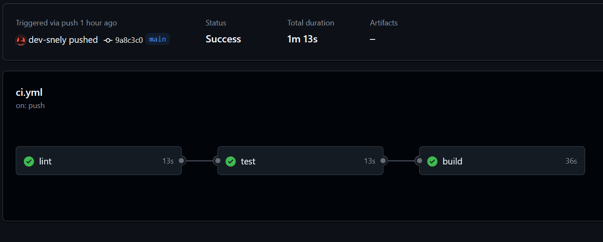

# Laboratoire 0 - Infrastructure - Docker, Kubernets, Version Control, CD/CI
###### Cours : Architecture Logicielle (LOG430)
###### Session : ÉTÉ 2025
###### Date du laboratoire : Semaine du 12 mai 2025

## Présentation

Ce projet est une application minimaliste construite avec **Spring Boot**, déployée dans un **conteneur Docker**, et intégrée avec une pipeline **CI/CD GitHub Actions**.   L'objectif est de démontrer la capacité à conteneuriser une application, automatiser son déploiement et la rendre accessible via une machine de production (VM).

---
## Architecture du projet

- `src/main/java/com/log430/socle/`: Code source de l’application.
- `src/test/javacom/log430/socle/`: Tests pour le code source de l’application.
- `Dockerfile`: Définit la façon dont l’image Docker est construite.
- `.github/workflows/ci.yml`: Fichier de pipeline CI/CD.
- `README.md`: Documentation du projet.

---

## Étapes pour exécuter l'application localement avec Docker
### 1. Cloner le dépôt
```bash
git clone https://github.com/dev-snely/socle-technique
cd socle
```
### 2. Construire l'image Docker
```bash
docker build -t socle-api .
```
### 3. Lancer le conteneur
```bash
docker run -d -p 8080:8080 socle-api
```

---
## Intégration CI/CD
Une pipeline CI/CD GitHub Actions est configurée pour: 

1. **Linting** : Vérifier la qualité du code avec [Checkstyle](https://checkstyle.org/).
2. **Tests unitaires** : Exécuter les tests (le cas échéant, le pipeline l'indique).
3. **Build** : Compile l’application et construit une image Docker.
4. **Publication** : Publie automatiquement l’image sur Docker Hub.

##### *Exemple de pipeline réussie :*


👉 [Lien vers les actions Github](https://github.com/dev-snely/socle-technique/actions)

---
## Déploiement sur une machine distante (VM)
Une fois connecté par ssh sur la VM de production, vous pouvez exécuter:
```bash
docker pull docker.io/snely/springboot-app:latest
docker run -d -p 8080:8080 docker.io/snely/springboot-app:latest
```
---

## Choix faits dans le projet

### Pourquoi Spring Boot ?
Spring Boot a été choisi parce qu’il permet de créer une application Java rapidement, avec une structure claire. Il gère tout ce qui est configuration et démarrage automatiquement. Finalement, c'est un langage avec lequel j'ai un peu plus de facilité en terme de lecture.

### 🐳 Pourquoi Docker ? 
En gros, Docker permet de "mettre dans une boîte" toute l’application pour être sûr qu’elle fonctionne partout de la même façon, que ce soit en local, sur GitHub ou sur une VM. Le `Dockerfile` est utilisé pour construire l’image de l’application.

### Lint avec Checkstyle
Checkstyle sert à vérifier que le code suit des règles de style (par exemple : pas de lignes trop longues, commentaires, noms bien choisis, etc.). Ça rend le code plus propre et plus facile à lire.

### Connexion à Docker Hub
Pour pouvoir envoyer automatiquement l’image sur Docker Hub, on utilise des variables secrètes dans GitHub (`DOCKER_USERNAME` et `DOCKER_PASSWORD`) au lieu d’écrire les identifiants en clair.

### Déploiement sur la VM
La machine virtuelle est utilisée comme "serveur de production". On y lance le conteneur Docker avec l’image téléchargée depuis Docker Hub.


---
## Auteur
Snely Lys - @dev-snely
