# Partie 1 - Analyse et conception

## 1. Analyse des besoins fonctionnels et non-fonctionnels du système/Attributs de qualités

### 1.1. Au niveau des besoins fonctionnel

- Gérer les ventes de produits (ajout/suppression de produits dans une vente, calcul total).
- Gérer les retours de produits. (Annuler une vente)
- Consulter le stock de produits.
- Ajouter/modifier/supprimer des produits (admin).

### 1.2. Attributs de qualités / besoin non-fonctionnel

- Simplicité d'utilisation (interface console claire).
- Fiabilité (intégrité des données).
- Portabilité (cross-platform via Java).
- Persistant (les données doivent survivre au redémarrage)
- Temps de réponse rapide pour les requêtes.

## 2. Proposition d'architecture 4+1

### 2.1. Vue logique (Diagramme de classes)

Classe principales:
`Produit`: id, name, prix, quantite
`Vente` : d, date, listeDeProduitVendu, total
`Retour`: id, date, referenceDeVente, produitsRetournes

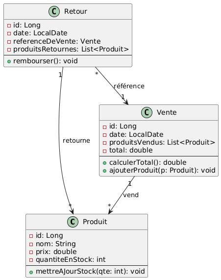

### 2.2. Vue des processus - DSS

La vue des processus met en évidence les échanges entre le client (interface console) et le système (application + base de données) pour chacun des cas d'utilisation métier identifiés.

Les prochains DSS résument les différentes interactions qu'il y aura entre la console client et la base de données via l'ORM (JPA/Hibernate) pour les différents diagrammes de cas d'utilisation.

1. **Rechercher un produit**
   L’utilisateur saisit un critère de recherche (nom, identifiant ou catégorie) et le système retourne une liste de résultats.
   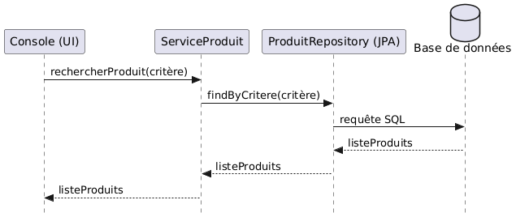

2. **Enregistrer une vente**
   L’utilisateur démarre une vente, sélectionne les produits, obtient le total et confirme l'enregistrement.
   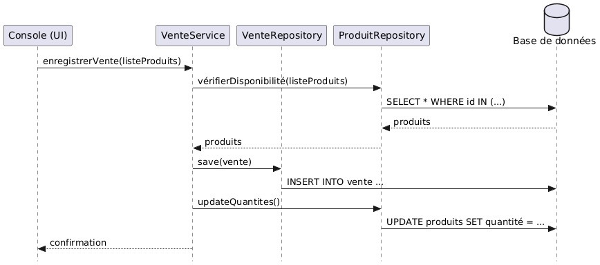

3. **Gérer un retour**
   L’utilisateur fournit la référence d’une vente existante et sélectionne les produits à retourner.
   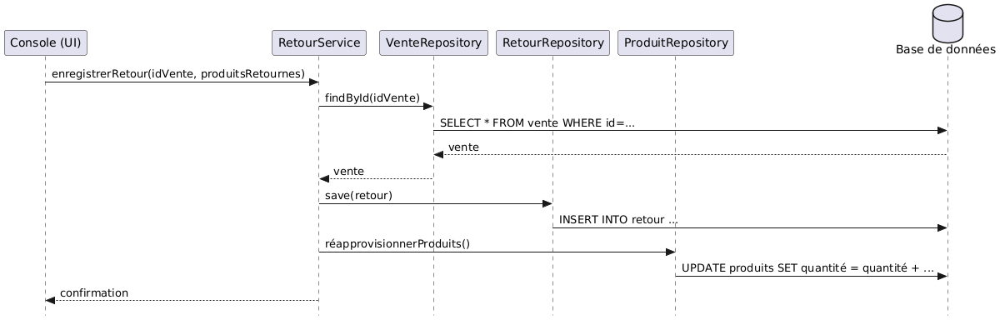

4. **Consulter le stock**
   L’utilisateur déclenche l’affichage de l’état du stock, qui liste tous les produits disponibles et leur quantité.
   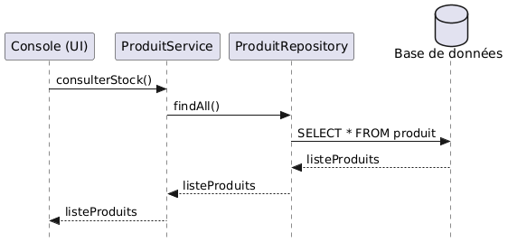

### 2.3. Vue de déploiement - Modèle 2 tiers

Voici une vue sur l'organisation physique du système avec le client console local (UI + logique métier) et la base de données pour la persistance des données.

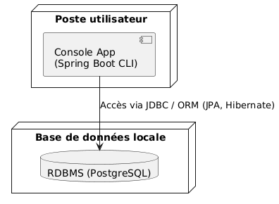

### 2.4. Vue d'implémentation - Organisation des modules

Dans cette architecture, on suit le principe de séparation des responsabilités avec une organisation claire en trois couches.

```text
├── pom.xml
└── src/
    ├── main/
    │   ├── java/
    │   │   └── com.monmagasin/
    │   │       ├── ui/
    │   │       ├── service/
    │   │       ├── model/
    │   │       └── repository/
    │   └── resources/
    │       └── application.properties
    │
    └── test/
        └── java/
```

#### 2.4.1 Présentation (UI / Console)

**Rôle**: Cette couche gère l’interaction avec l’utilisateur via l'interface console.

**Contenu**: Menus, affichages et saisies utilisateur.

**Classes**: Main, ConsoleUI, MenuHandler, etc.

**Pourquoi**: Permet de dissocier l’interface utilisateur de la logique métier, ce qui facilite la production des tests unitaires de la logique.

#### 2.4.2 Logique métier (Service / Domaine)

**Rôle**: Contient la logique des opérations métier (ventes, retours, stock).

**Contenu**: Vérifications, calculs, gestion des règles métiers.

**Classes**: VenteService, ProduitService, RetourService, etc.

**Pourquoi**: Centralise les règles du métier, ce qui permet de les tester indépendamment.

#### 2.4.3 Persistance (DAO / Repository)

**Rôle**: Accède à la base de données via une abstraction ORM (ex: Spring Data JPA).

**Contenu**: Requêtes de lecture/écriture, entités JPA.

**Classes**: ProduitRepository, VenteRepository, RetourRepository, etc.

**Pourquoi**: Utiliser JPA/Hibernate permet de ne pas écrire de SQL manuellement, rendant la couche persistance plus maintenable et portable.

### 2.5 Vue de cas d'utilisation

#### Diagramme de cas d'utilisation avec l'exploitation du système

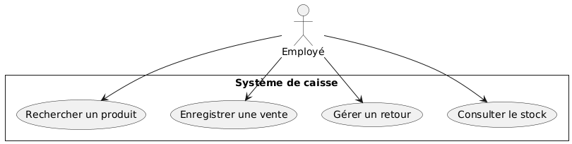

_EN RESUMÉ:_
**Rechercher un produit:** L’employé peut rechercher un produit dans le système en utilisant un identifiant, un nom ou une catégorie. Le système affiche les résultats correspondants.

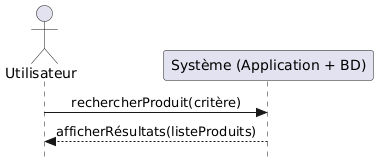

**Enregistrer une vente:** L’employé sélectionne les produits achetés par un client. Le système calcule automatiquement le total, enregistre la vente et met à jour les quantités de stock.

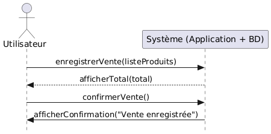

**Gérer un retour:** L’employé peut annuler une vente partielle ou complète à l’aide de sa référence. Le système met à jour le stock en conséquence.

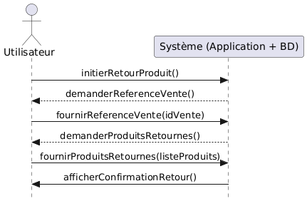

**Consulter le stock:** L’employé peut visualiser l’état actuel du stock (quantité disponible, produits en rupture, etc.).

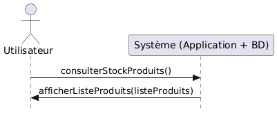

## 3. ADR - Architecture Decision Records

### ADR-001 : Choix de l’organisation Maven

#### Date

2025-05-24

#### Contexte

Le système de caisse présent repose sur une application Java développée avec Spring Boot. Il s'agit d’un système de caisse en architecture client/serveur à deux niveaux, dans lequel le client est une application console locale. Une organisation claire des modules est nécessaire pour séparer les responsabilités : présentation, logique métier et persistance.

#### Décision

J'ai décidé de prendre l’organisation standard Maven avec les dossiers `src/main/java`, `src/main/resources`, `src/test/java`, et de structurer le code par packages selon les couches suivantes :

- `presentation` (console UI),
- `service` (logique métier),
- `repository` (accès aux données),
- `model` (entités),
- `config` (configuration Spring, JPA...).

#### Justification selon les critères

| Critère                           | Justification                                                                                                                                          |
| --------------------------------- | ------------------------------------------------------------------------------------------------------------------------------------------------------ |
| **Simplicité**                    | Maven est standardisé et bien intégré dans les IDE (comme IntelliJ ou Eclipse). La structure est connue, ce qui facilite la prise en main.             |
| **Convention over configuration** | Suivre la convention Maven/Spring Boot permet d’éviter des configurations manuelles inutiles. Spring reconnaît automatiquement les packages standards. |
| **Portabilité**                   | Maven fonctionne partout où Java est installé, sans dépendances propriétaires.                                                                         |
| **Interopérabilité Spring Boot**  | Maven s’intègre très bien avec Spring Boot : gestion des dépendances (via `pom.xml`), phases de build, plugins utiles (test, package, etc.).           |
| **Tests et CI/CD**                | La séparation des tests (`src/test/java`) facilite leur exécution automatique via des outils comme GitHub Actions ou Jenkins.                          |
| **Évolutivité**                   | Cette organisation permet de faire évoluer facilement le projet vers une architecture plus modulaire (par exemple, multi-modules).                     |

#### Alternatives envisagées

1. _Il devrait être possible de mélangé la logique console et la logique métier_
   Verdict: REJETÉ, car il rendrait le code spaghetti et non testable.

2. _Architecture en couches plus fine (Clean Architecture/Hexagonal)_ :
   Verdict: REJETÉ, trop complexe pour un travail une les besoin demandé dans ce projet. Ça demanderait le'ajout d'une couche controllers, adaptaters, ports, ce qui est trop poussé pour le moment.

#### Conséquences

- Le code reste clair, modulaire, et conforme aux bonnes pratiques d’architecture logicielle.
- Nécessite une injection de dépendances (Spring) pour relier les couches.

### ADR-002 : Choix du mécanisme de persistance — JPA avec base de données relationnelle

#### Date

2025-05-24

#### Contexte

Le système de caisse doit stocker de manière durable les entités telles que les produits, les ventes et les retours. Le stockage doit permettre des recherches, des mises à jour et des suppressions simples.

#### Décision

J'ai choisi d’utiliser une base de données relationnelle (RDBMS) avec l’ORM JPA (implémenté par Hibernate) pour la persistance des données.

#### Justification selon les critères

| Critère                                     | Justification                                                                                                                                                 |
| ------------------------------------------- | ------------------------------------------------------------------------------------------------------------------------------------------------------------- |
| **Modèle relationnel**                      | Les entités (produits, ventes, retours) ont des relations logiques (ex. une vente contient plusieurs produits), ce qui correspond bien au modèle relationnel. |
| **Fiabilité et robustesse**                 | Les RDBMS comme PostgreSQL ou H2 sont éprouvés, robustes, et largement utilisés.                                                                              |
| **Support out-of-the-box dans Spring Boot** | JPA et Hibernate sont intégrés nativement et très bien supportés.                                                                                             |
| **Simplicité de développement**             | Spring Data JPA permet d’écrire peu de code pour des opérations CRUD.                                                                                         |
| **Transactions**                            | Le modèle transactionnel est bien géré et crucial pour des opérations comme l’enregistrement d’une vente.                                                     |

#### Alternatives envisagées

| Alternative                                            | Raisons de rejet                                                                                     |
| ------------------------------------------------------ | ---------------------------------------------------------------------------------------------------- |
| **Base NoSQL (MongoDB)**                               | Moins adapté au modèle relationnel des entités. Moins de cohérence sans transaction ACID par défaut. |
| **Fichiers plats ou base embarquée non relationnelle** | Moins fiable, plus difficile à requêter et maintenir.                                                |
| **JDBC direct**                                        | Trop bas niveau et verbeux par rapport à JPA.                                                        |

#### Conséquences

- L’application pourra utiliser un SGBD léger comme H2 en développement, et un SGBD complet (ex. PostgreSQL) en production.
- Le mapping entre entités Java et tables SQL est automatisé.
- Il faudra gérer le schéma (soit par JPA auto-generation, soit via migration si nécessaire).

## 4. Choix technologiques

### 4.1. PostgreSQL

Pour ce projet, nous avons choisi PostgreSQL comme SGBD relationnel. Ce choix s’appuie sur sa compatibilité native avec Spring Boot et JPA, sa robustesse en termes de transactions, ainsi que son caractère open source et multiplateforme. PostgreSQL offre une modélisation relationnelle forte, parfaitement adaptée aux entités du système de caisse (produits, ventes, retours).

### 4.2. JPA / Hibernate

Le projet utilise JPA (Java Persistance Api) comme spécification de persistance, car elle fournit un modèle standardisé, maintenable et documenté pour interagir avec une base de données relationnelle. L’implémentation choisie est Hibernate, qui est le moteur JPA par défaut dans Spring Boot. Ce choix permet de bénéficier d’une intégration des données fluide, d’un système mature de gestion des entités, et d’une compatibilité directe avec PostgreSQL.

Sa dépendance est la suivante:

```xml
<!-- https://mvnrepository.com/artifact/org.springframework.boot/spring-boot-starter-data-jpa -->
<dependency>
    <groupId>org.springframework.boot</groupId>
    <artifactId>spring-boot-starter-data-jpa</artifactId>
    <version>3.5.0</version>
</dependency>
```
